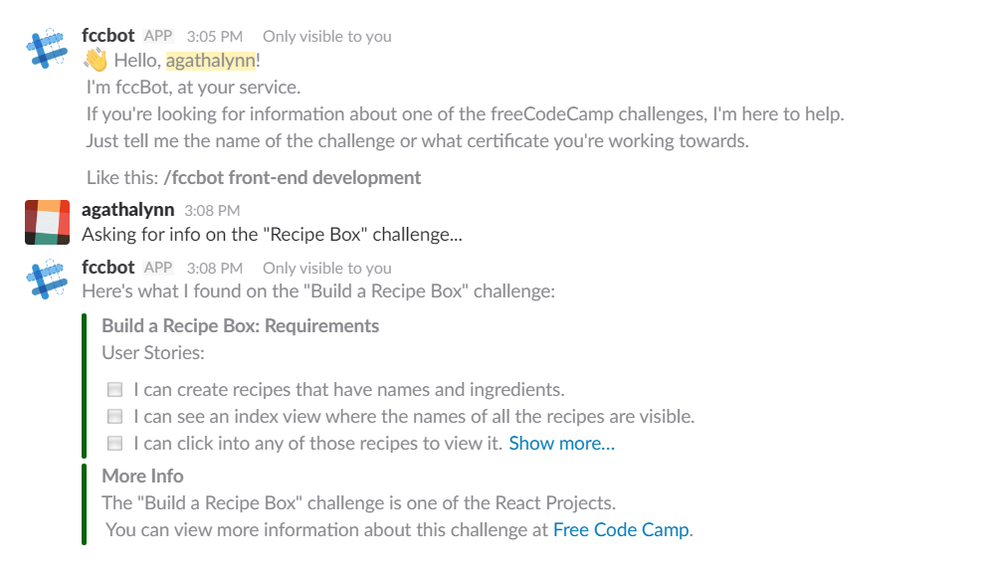
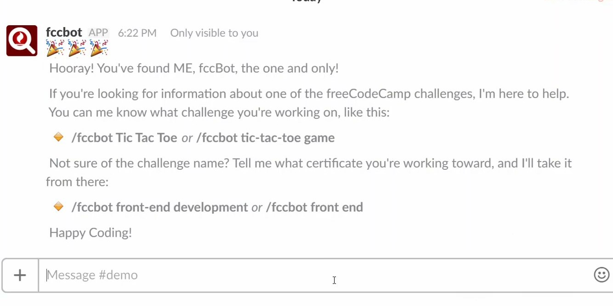
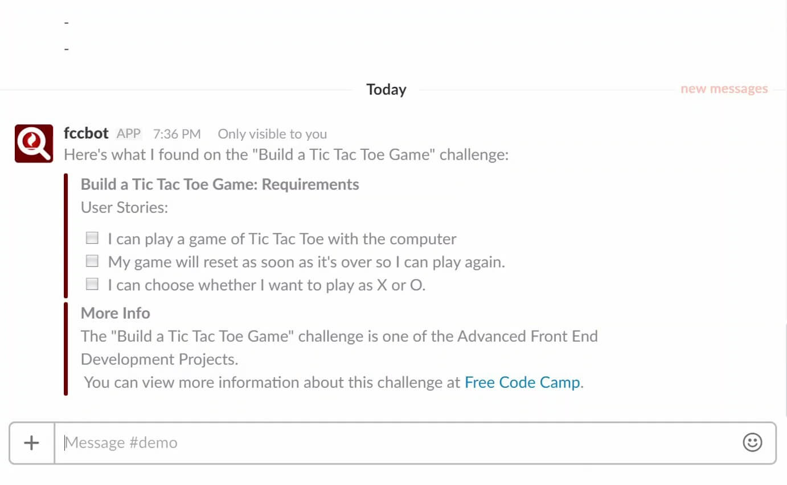
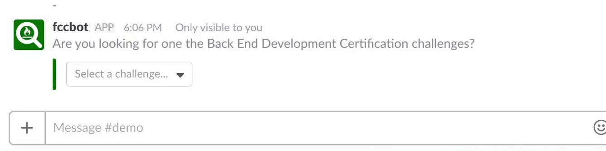
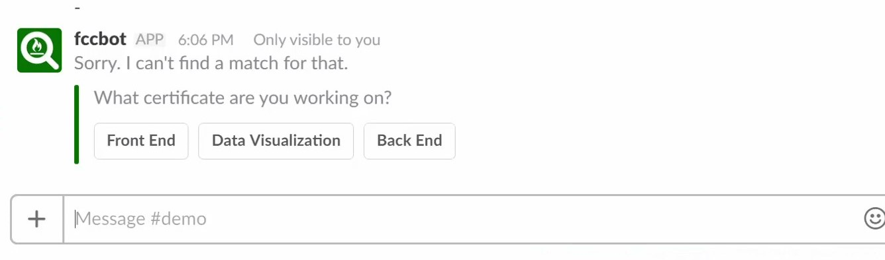

# fccBot

A Slack app providing an easy way to view the User Stories / Challenge Requirements for whatever freeCodeCamp project you're currently working on. Right from Slack!



# I *want* it...

Good news! You, too, can use fccBot. To install the app to your Slack team, head over to the [project webpage](http://slack-fccbot.herokuapp.com/) and click the "Add to Slack" button.


If you'd prefer to create your own fccBot clone, I'd love to see what you come up with. After all, every time a new fccBot is incarnated, an angel gets his wings. Or something.

# How does it work?

You boss him around, and he (mostly) does what he's told.

Type `/fccbot` to see a welcome message and usage hints:

```
/fccbot
```



Type `/fccbot [challenge name]` to see information on one of the freeCodeCamp challenges. The fccBot will also recognize many partial challenge names:

```
/fccbot tic tac toe
```



You can also search projects by certificate. Type `/fccbot [certificate name]` to select a challenge:

```
/fccbot back end
```



If you can't remember a challenge name, fccBot will point you in the right direction:

```
/fccbot harry potter
```



# Can I help?

Yes, please. Help and feedback are much appreciated!

# Info/Credits

A Build.to.Learn project, created by members of the Rhino cohort (a group of wannabe programmers learning together - more info [here](https://tropicalchancer.github.io/projectus/)). Many thanks to @periman2 for his help getting this project up and running!

This project was created as a resource for individuals working through the freeCodeCamp curriculum. It was not created or endorsed by freeCodeCamp... although I like to think that they would approve.
