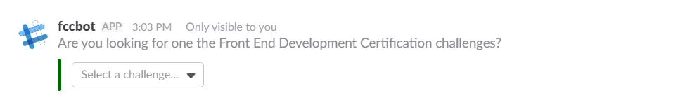

# fccBot

A Slack app providing an easy way to view the User Stories / Challenge Requirements for whatever Free Code Camp project you're currently working on. Right from Slack!


# I *want* it...

The good news is that you, too, can use fccBot. The bad news? You can't use it *yet*. Unless you want to create your own fccBot clone, using this code.

Which you are absolutely free to do. Every time a new fccBot is incarnated, an angel gets his wings. Or something.

# How does it work?

You boss him around, and he (mostly) does what he's told.

You can ask for info on a specific challenge:

```
/fccbot timestamp microservice
```

Or even use part of the challenge name:

```
/fccbot leaderboard
```

If fccBot's still getting confused? Just tell him which certificate you're working towards, and he'll take it from there:

```
/fccbot front end
```



# Can I help?

Yes, please. Help and feedback are much appreciated!

# Info/Credits

A Build.to.Learn project, created by members of the Rhino cohort (a group of wannabe programmers learning together - more info [here](https://tropicalchancer.github.io/projectus/)). Many thanks to @periman2 for his help getting this project up and running!
